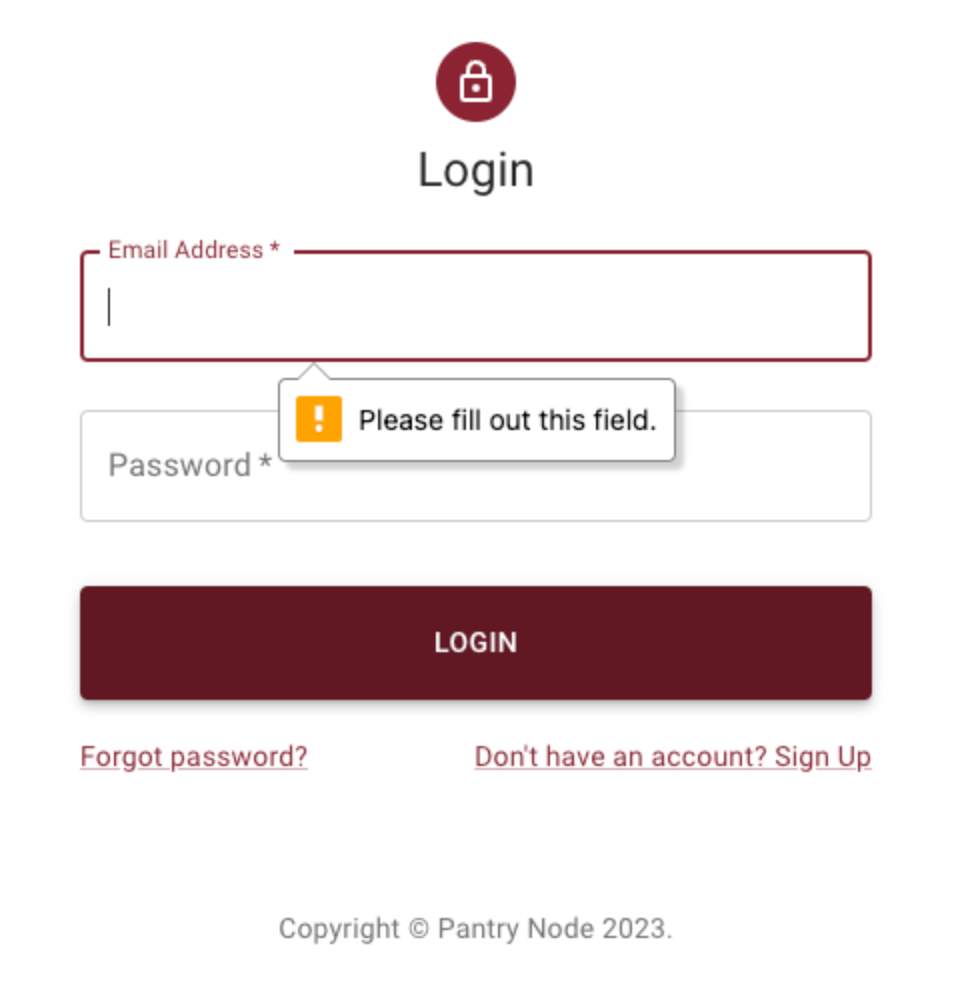
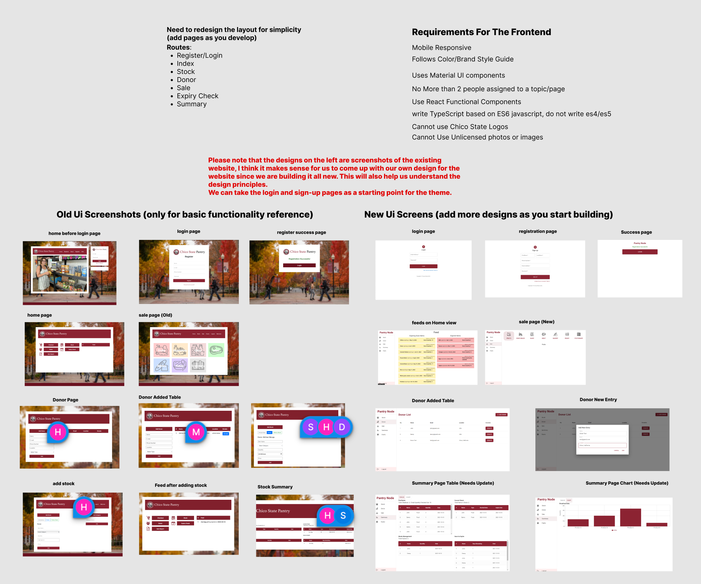
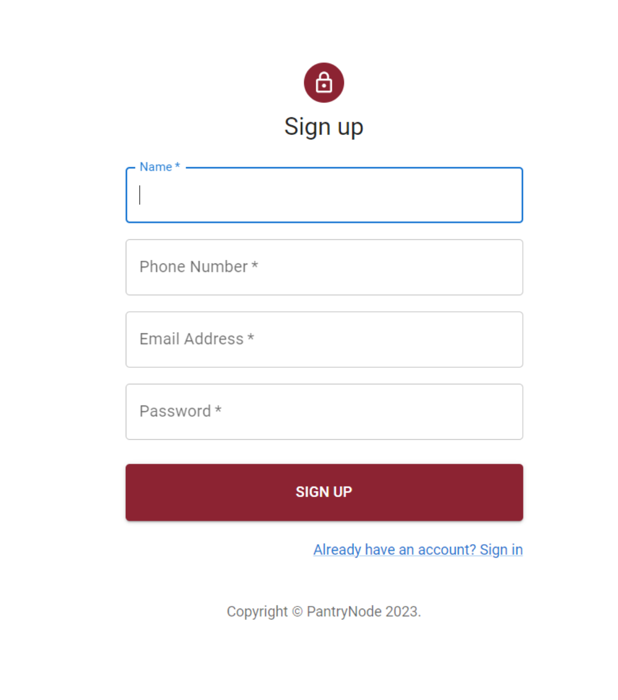

https://docs.google.com/document/d/1BXg5B9aKHOtGQU2GeE7wC7UG_G58wI5jgeeGzOtTNdQ/edit
  

    

## Preston Blake

# Pantry Node Progress 
# Gallery 
  

 
  
  
  

  

  
  
# highlights 
- Took a leadership role in architecting how the frontend application would be developed
- Created the initial react application and merged it into main branch in a seperate folder
- Built the login and signup flow 
- helped decide which dependencies and styling to follow for the build 
- built a Figma project with all the different screens to be developed (screenshooting running previous application, labeling, and layout design guidelines practices).
# timeline 
### Sprint 1 (February 28 - March 20):
- Created the initial React Typescript and added to an isolated directory (https://github.com/ChicoState/PantryNode/pull/36)
- built a Figma project with all the different screens to be developed (https://www.figma.com/file/Ioe4ZC15X3NFJMSZPHeuPr/Pantry-Node-team-library?type=design&node-id=0%3A1&t=5anUsNtQZ2wqrnO0-1) 
- created a color guide for the frontend (in the figma project link)
- created a style guide for the frontend (in the figma project link)
- Opened the frontend issue which served as the main issue for mapping progress of the frontend team (https://github.com/ChicoState/PantryNode/issues/46) 
- added comments such as (https://github.com/ChicoState/PantryNode/issues/46#issuecomment-1463169116) to the frontend issue.
- ran scrums as scrum leader and reported progress to class during class standups 
### Sprint 2 (March 21 - April 3):
- Built the Login & Signup Screens https://github.com/ChicoState/PantryNode/pull/84
- reviewed and accepted multiple pull requests so that they coudl be merged into main 
- Open an issue for creating Documentation Of Dependencies For Frontend Update Readme.md with how to start and dependencies. (Create Documentation Of Dependencies For Frontend Update Readme.md with how to start and dependencies). I ultimately completed this issue myself in a later sprint. But there was good debate and contributions from team members in this issue. 

- Created an issue for developing the home screen and outlined what exactly needed to build and what style guidelines to follow. (https://github.com/ChicoState/PantryNode/issues/68)
- Opened the issue to update some minor issue with the form validation with the login & register (https://github.com/ChicoState/PantryNode/issues/89)

- Built out the form validation and axios requests for login and register https://github.com/ChicoState/PantryNode/pull/84

- ran scrums as scrum leader and reported progress to class during class standups
### Sprint 3 (April 4 - 17):
- created the first interaction login between the frontend and the backend application using axios http request client as well as useState and useEffect hook https://github.com/ChicoState/PantryNode/pull/101
- reviewed and accepted multiple pull requests so that they coudl be merged into main 
- ran scrums as scrum leader and reported progress to class during class standups
### Sprint 4 (April 18 - May 1):
- update the frontend readme to reflect dependencies as well as page structure (https://github.com/ChicoState/PantryNode/pull/220)
- reviewed and accepted multiple pull requests so that they coudl be merged into main 
### Sprint 5 (May 2 - 15):
- worked with Mike to get CORS headers working allowing the frontend to talk to the backend (https://github.com/ChicoState/PantryNode/issues/120)

